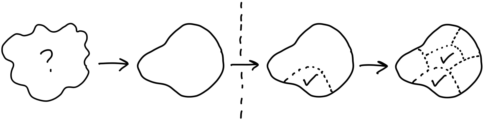

# Eleven Hackaton October 2019

<!-- ---- -->
<!-- {: fullscreen-img="img/title_image.png"} -->

---

## Overview

{::options parse_block_html="true" /}

- Part 1: Planning & Process
    - Warm up / reflection / grounding
    - Shape Up (theory)
    - Shape Up interaction & discussion
    - Cycles & Rhythms
    - De-risking

- Part 2: Communication & Documentation
    - Communication ladder
    - Documentation (theory)
    - Documentation mapping
    - Mob wiki Gardening

- Writing Workshop

---
{:.header}

# Planning & Process

---
{:.header}

# Warm Up

<!-- 1 hour, 30 mins each way -->

----
## Project Reflect

You've all been asked to pick a project you worked on, and make a list of issues/wiki pages/pull requests, etc.

In this warm-up exercise you are going pair up with someone who wasn't involved in the project, and loop them in using the information you gathered, and the following questions.

---

1. Start with a problem statement: what problem were you trying to solve?
2. Did you dive in and start coding, or did you articulate a proposed solution first?
3. Does the final implementation match what you had in mind at the start?
4. Were there things you only discovered along the way? Either about the problem, or the proposed solution? How did this impact the delivery?
5. In hindsight are there aspects that should have been documented better? Make a note of them, we can work with that during the writing workshop.

---
{:.header}

# Shape Up

<!-- presenting theory: 30 minutes -->

---
## Shape Up, by Basecamp

Available on-line, 14 chapters, takes 2~3 hours to read.

---
## Shape Up

Problem statement:
- company growing fast
- projects start taking forever
- shipping rate drops
- not enough time for strategic thinking

---
## Key Concepts

- 6 Weeks Cycle + 2 Weeks cool-down
- Appetites, not Estimates
- No central backlog
- Shaping → Betting → Building
- Discovering the work

---
## 6 + 2 Weeks

Long enough to do "deep" work, short enough to see the end.

Small teams work autonomosly, end of six weeks the works needs to be done (= deployed).

Work has been "shaped" beforehand to prevent rabbit holes.

---
## Shaping

Really thinking something through

Happens behind closed doors, one or a few people, end result is a Pitch

Rough and high level, but all the elements are there and add up

---
## Pitch

Document containing

- Problem statement
- Appetite
- Solution
- Boundaries

---
## Shaping

Requires strategic insight (what's important)

Design sense (how should this work)

Technical literacy (how hard would this be)

Writing/communication skill (how to explain this clearly)

---
## Finding the Elements

What are the places and affordances, how do they connect?

[Breadboards](https://basecamp.com/shapeup/1.3-chapter-04#breadboarding)

[Fat Marker Sketches](https://basecamp.com/shapeup/1.3-chapter-04#fat-marker-sketches)

_Not_ wireframes, DB schemas, etc.

----
## Betting

Small number of stakeholders look at all the Pitches (e.g. CEO, CTO, team lead)

Who's available this cycle? What's realistic in 6 weeks?

End result: assigned tasks, let's start building

No backlog, anyone can keep their own list and submit pitches

---
## Building

[Start with a vertical slice](https://basecamp.com/shapeup/3.2-chapter-10)

[Map the Scopes](https://basecamp.com/shapeup/3.3-chapter-11)

[Show progress, Get over the Hill](https://basecamp.com/shapeup/3.4-chapter-12)

---
## Trying it out

Next time you are assigned a task, try shaping it first.

Write a problem description, make a breadboard of the proposed solution, list up what's in and out of scope.

Go over it with Noe, check assumptions, refine.

---
{:.header}

# Shape Up, Discussion

<!-- 1 hour -->

---
## Shape Up, Discussion

Everybody opens their laptop and read through the table of contents and the glossary.

Open the sections that spark your interest or that you think would be interesting for Eleven, read through them and make notes on an index card. Mention chapter numbers. (20 minutes)

Next we go over the chapters, people present what they wrote down, and we discuss briefly.

---
## Shape Up, Prompts

Shape Up has Pitch/Scope/Task, what's the nearest equivalent for Eleven?

What are Eleven's cycles? What's the time horizon?

---
## Shape Up, Key Vocab

- Appetite
- Uphill/Downhill/Over the hill
- Vertical Slice
- Breadboard/Place/Affordance

---
{:.header}

# Cycles & Rhythm

### or
{: style="text-align:center; margin: 0; padding: 0;"}

### Feedback loops and hammock time
{: style="text-align:center; margin: 0; padding: 0;"}

---
## Feedback loops and hammock time

Coding can be social or solitary

Social: pairing, mob programming

Solitary: hammock time, going up the mountain

This is a sliding scale!

---
## Small feedback loops

Pair programming, small increments, quickly review and merge. Benefits:

- quick course correction
- knowledge sharing
- group buy-in
- no diverging code history
{:.next}

---
## Larger feedback loops

Giving people the autonomy to go work on something and report back later.

- undistracted work → reach a State of Flow
- time to research and think through possible solutions → hammock time
- greater feeling of autonomy and agency → important for people's satisfaction in their work
- pairing is a skill, can be draining
{:.next}

---
## Feedback Loops

Where do you fit? Put your dot on the chart

Left extreme: all the pairing all the time 
Right extreme: come down from the mountain when you're done

---
## Discussion Prompts

Where do you feel Eleven is as a whole on this scale?

How well do the current processes and cycles suit you?
{:.next}

Are there certain tasks that work better with longer or shorter cycles?
{:.next}

Do you feel you generally know what's up in the rest of the company?
{:.next}

---
{:.header}

# De-risking

---
## De-risking

Most cycle-based processes are meant do decrease the risk of things spinning out
of control.

What are some of the things that we can do at each part of the process to reduce
the risk of not shipping?

People can call out suggestions, then we'll look at the things I wrote down.

---
## De-risking

During shaping / pitch-writing

- Narrow down the problem
- Consult users and devs
- identify potential problem areas
- remove rabbit holes
{:.next}

---
## De-risking

At start of dev

- REPL it (poke at it!), use repl_sessions
- Information gathering
    - 3rd part APIs, dependencies → where are the docs? poke at it!
    - contacts, user (if possible), people who can tell you about other parts of the system
{:.next}

---
## De-risking

During dev

- Tracer code, vertical slice
- Map the scopes, discovered tasks
- Be vigilant about rabbit holes
- Establish feedback loops
    - Single end to end test
    - User or proxy thereof (validate job to be done)
{:.next}

---
## De-risking

Towards end of cycle

- Consolidate
    - Documentation
    - Tests
    - Specs
- Scope hammering, eye on the price (shipping)
{:.next}

---
{:.header}

# Documentation & Communication

---
{:.header}

# Communication

---

2. multi-person meeting
3. 1:1 video call
4. 1:1 voice call
5. synchronous specific-topic group chat (e.g. thread or new channel)
5. synchronous group chat in existing channel
 --- boundary of synchrony ---
7. email
8. wiki/documentation

---
## Ladder of communication

How often do you partake in a certain form of communication?

(Many times per day, daily, every few days, weekly, biweekly, monthly)

Do you initiate or respond?

When do you decide to (de-)escalate?

---
{:.header}

# Documentation

---
## Documentation

> Oral tradition, or oral lore, is a form of human communication wherein
> knowledge, art, ideas and cultural material is received, preserved and
> transmitted orally from one generation to another. -- Wikipedia

Funny because it's true?

---
## Documentation

Documentation challenges

- it doesn't happen
- it happens, but people don't find/read it
- people read it, but it doesn't help them make progress
- information gets stale/out of date

---
## Immutable logs

Keeping documentation up to date can be hard

Alternative approach: turn it into immutable log

Architecture docs --> Architectural Decision Log

Old entries never deleted or changed, only marked as "Superceded by"

---
## Immutable logs

Much easier to maintain

Provides not just static information but also timeline, context

Perfect source material for creating traditional/hierarchical docs

---
## Documentation Editor/Gardener

Role that people take on for fixed period of time (weeks to a month)

Carrousel, everybody gets their turn

Spends a bit of time every week reviewing, editing, organizing

Can flag outdated docs, and hand out writing tasks

---
{:.header}

# Documentation mapping

---
## Documentation Mapping

Figure out

- which documentation we want
- who's job it is to make it happen
- where it goes

---
## Documentation mapping (1/3)

What types of documentation do we want? (yes/no/maybe)

{::options parse_block_html="true" /}

- Architecture overview
- Architectural decisions
- Business domain
- End users docs
- Internal processes
- Coding conventions

- Code docs (functions, namespaces, packages)
- Team roles
- Meeting notes
- ...

---
## Documentation mapping (2/3)

Put "yes" and "maybe" at the top of an index card. Mark maybes with a "*"

Divide cards between two groups, each group goes over them, writes down:

- One line description
- Author
- Audience
- When is it created?
- Where does it go?

---
## Documentation mapping (3/3)

Swap the cards of group 1 and group 2.

Each group reviews, if they disagree they write their notes on the back.

---
{:.header}

# Mob Wiki Gardening

---
## Mob Wiki Gardening

Let's go through what's already in the wiki and do some tidying up

- Move pages
- Merge pages
- Add context
- Identify writing tasks

---
{:.header}

# Writing Workshop

---
## Writing Workshop

By now we should have lots of ideas of things to write.

We'll go over some general tips, and then start writing!

Halfway through and at the end we share and provide feedback.

If unsure, start with a namespace doc.

---
## Writing Tips

**Context, context, context**

What am I looking at? Why are you writing this?

**Be Eloquent**

Write full sentences with correct grammar and punctuation.

---
## Writing Tips

**Write out acronyms the first time you use them**

> The General Ledger (GL) is ...

- no
- bullet
- lists
- without
- context

---
## Namespace docs

One line description, complete the sentence "This namespace is ..."

Paragraph of context (why does this ns exist? how does it fit in?)

Concepts, abstractions, data structures, API (main entry points)

Caveats

---
## Pull / Merge Request

State problem and solution

Link back to Epic / design docs / etc

Mention impact on wider system

Add line comments

---
## Project Docs

Go back to the project you started with

- Are the business domain concepts they touch explained in the wiki?
- Are there architectural decisions that need to be documented?
- Is there anything non-obvious about how they work, either on the UI, or under the covers? Should that be documented?

---
{:.header}
# Conclusions

---
## Conclusions

What are the things from this workshop that you want Eleven to "take home"?

Everyone puts up their ideas on post-its, we cluster them, discuss and make action items.

---
## Resources

- Jorge Arango, Semantic Environments and Information Architecture (blog, 2013) [https://jarango.com/2013/05/02/semantic-environments-and-information-architecture/](https://jarango.com/2013/05/02/semantic-environments-and-information-architecture/)
- Basecamp: Shape up [https://basecamp.com/shapeup](https://basecamp.com/shapeup)
- The Tyranny of Structurelessness [https://www.jacobinmag.com/2019/09/tyranny-structurelessness-jo-freeman-consciousness-raising-women-liberation-feminism](https://www.jacobinmag.com/2019/09/tyranny-structurelessness-jo-freeman-consciousness-raising-women-liberation-feminism)
- [ClojuTRE 2019: Dealing with Unanticipated Needs - Dave Snowden](https://www.youtube.com/watch?v=xYqWREPb3Lc&list=PLetHPRQvX4a-c3KDRTxxwGRmEMutL8Apf&index=19&t=0s)

---
## Resources

- Thoughtworks blog: Workshop Wisdom [https://www.thoughtworks.com/insights/blog/workshop-wisdom](https://www.thoughtworks.com/insights/blog/workshop-wisdom)
- Gamestorming: choose your words wisely [https://gamestorming.com/choose-your-words-wisely/](https://gamestorming.com/choose-your-words-wisely/)
- [Badass: Making Users Awesome - Kathy Sierra](https://www.amazon.com/Badass-Making-Awesome-Kathy-Sierra/dp/1491919019)
- [Competing Against Luck - Clayton M. Christensen](https://www.amazon.com/Competing-Against-Luck-Innovation-Customer/dp/0062435612)
- [The Pragmatic Programmer](https://pragprog.com/book/tpp20/the-pragmatic-programmer-20th-anniversary-edition)
